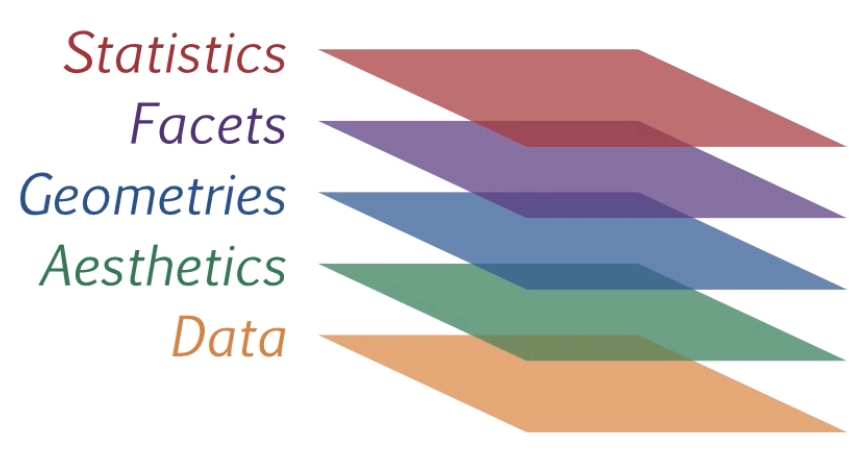

```{r, message=FALSE, echo=FALSE}
library(readxl)
library(dplyr) # paquete majeno de bases de datos
library(ggplot2)    # paquete de graficos por capas
library(highcharter) # paquete de graficos dinamicos
library(plotly)
library(shiny)

library(datasets)  # paquete con grupo de datos
```

## Introducción

Antes de empezar, pencemos en las alternativas que se tienen para utilizar el programa estadistico R.
  + Instalado en un computador
      + **R**  

      + **RStudio**

      + **Rcmdr** (librerias Rcmdr y RcmdrMisc)

+ Ahora en linea

      + [**RDRR.io**](https://rdrr.io/snippets)

      + [**Rextexter**](https://rextester.com/l/r_online_compiler)

---


## Gráfico

Una gráfica o una representación gráfica o un gráfico, es un tipo de representación de datos, generalmente cuantitativos, mediante recursos visuales (líneas, vectores, superficies o símbolos), para que se manifieste visualmente la relación matemática o correlación estadística que guardan entre sí.

Wikipedia

## Gráfico en R

 

---

### Gráficos con R base

.pull-left[
```{r}
cc=c(20, 10, 20, 20, 20, 20, 20, 20, 20, 30, 20, 20, 20, 10, 30, 20, 20, 30, 20, 30, 30, 20, 10, 30, 20, 20, 30, 30, 10, 20, 10, 20, 20, 20, 10, 20, 10, 20, 20, 30, 30, 30, 10, 30, 20, 20, 20, 20, 20, 20, 10, 20, 30, 30, 10, 10, 10, 20, 10, 20, 10, 30, 20, 10, 20, 30, 10, 30, 30, 30, 20, 30, 30, 30, 30, 30, 30, 20, 10, 30, 10, 20, 20, 10, 20, 20, 20, 20, 10, 20); labs=c("Ing. Industrial","Administración ","Contaduría "); pct=round(table(cc)/sum(table(cc))*100); labs=paste(labs, pct);labs=paste(labs, "%", sep = " "); pie(table(cc), labels=labs, main=" Distribución por carrera")
```

]

.pull-right[
```{r}
ev=table(rbinom(90,5,0.80)); barplot(ev, col=c("red","yellow","orange","green","blue"), main = "Evaluación proceso de inducción")
```


]

Los anteriores ejemplos pueden ser ejecutados en cualquiera de las anternativas presentadas para usar **R**
---
## Graficos con R base

.pull-left[

```{r}
nf=c(4.1, 2.7, 3.1, 3.2, 3.0, 3.2, 2.0, 2.4, 1.6, 3.2, 3.1, 2.6, 2.0, 2.4, 2.8, 3.3, 4.0, 3.4, 3.0, 3.1, 2.7, 2.7, 3.0, 3.8, 3.2, 2.2, 3.5, 3.5, 3.8, 3.5, 3.9, 4.2, 4.3, 3.9, 3.2, 3.5, 3.5, 3.7, 4.1, 3.7, 3.5, 3.6, 3.2, 3.1, 3.4, 3.0, 3.0, 3.0, 2.7, 1.7, 3.6, 2.1, 2.4, 3.0, 3.1, 2.5, 2.5, 3.6, 2.2, 2.4, 3.1, 3.3, 2.7, 3.7, 3.0, 2.7, 3.0, 3.2, 3.1, 2.4, 3.0, 2.7, 2.5, 3.0, 3.0, 3.0, 3.2, 3.1, 3.8, 4.1, 3.7, 3.5, 3.0, 3.7, 3.7, 4.1, 3.7, 3.9, 3.7, 2.0); stem(nf)
```

]
.pull-right[
```{r}
h1=hist(nf, main = "Nota final matemáticas fundamentales", xlab = "nota", ylab="frecuencias absolutas", labels=TRUE, col="lightblue"); abline(v=3,col="red")
```

]
---
## Graficos con R base

.pull-left[
```{r}
boxplot(nf, main="Nota final matemáticas fundamentales"); abline(h=3, col="red")
```
]
.pull-right[
```{r}
boxplot((nf~cc),main="Nota final matemáticas fundamentales"); abline(h=3, col="red"); abline(h=4, col="blue")
```
]

---
## Graficos con R base

.pull-left[
```{r}
ed=round(rnorm(90,18,1),1); plot(ed,nf, main="Edad vs Nota final matemáticas fundamentales", ylim = c(0,5), xlab = "Edad", ylab = "Nota final"); grid()
```
]
.pull-right[

### Resumen 
```{r, eval=FALSE}
x=rnorm(100,100,20)
y=rnorm(100,100,25)
z=rbinom(100,4,0.30)
t=1:100
par(mfrow=c(1, 5))
pie(table(z))
barplot(table(z))
stem(x)
hist(x)
boxplot(x)
plot(x,y)
plot(t,y, type="l")
plot(density(x))


```

https://rextester.com/CBC3320 <br/>
https://rextester.com/KBQL21515 <br/>
https://rdrr.io/snippets/


]
---

## Graficos con ggplot2
.pull-left[

+ **Data**: capa de los datos

+ **Aesthetics**: capa estetica (**aes**), definimos las variables a utilizar en el gráfico

+ **Geometries**: capa de geometrias, se define el tipo de gráfica a realizar

+ **Facets**: capa de facetas, permite detallar la gráfica por categorias

+ **Statistics**: capa de estadística, permite agregar modelos

+ **Coordinates**: capa de coordenadas, permite ajustar las escalas de los ejes

+ **Theme**: capas de características del gráfico que no dependen de  los datos

]
.pull-right[

]

**Gramatica de los graficos**
---
.pull-left[

[Visualizacion de datos con ggplot2](https://rstudio.com/wp-content/uploads/2015/03/ggplot2-cheatsheet.pdf)


```{r}
clasificacion=read.csv("spi_global_rankings_intl.csv")
ggplot(clasificacion, aes(x=off , y=def))
```
]
.pull-right[

]

---
.pull-left[
```{r}
ggplot(clasificacion, aes(x=off , y=def))+
  geom_point()

```
]
.pull-right[

]

---
.pull-left[
```{r}
ggplot(clasificacion, aes(x=off , y=def))+
  geom_point()
  
  

```

]
.pull-right[

+ geo_point()
+ geom_bar()  geom_col()  stat_count()
+ geom_boxplot()         stat_boxplot()
+ geom_density()         stat_density()
+ geom_histogram()
+ geom_violin()
+ ...
]
---
.pull-left[
```{r}
ggplot(clasificacion, aes(x=off , y=def))+
  geom_point()+
  facet_wrap(~ confed)

```


]
.pull-right[

]
---
.pull-left[
```{r, message=FALSE, warning=FALSE}
ggplot(clasificacion, aes(x=off , y=def))+  geom_point()+
  facet_wrap(~ confed)+ stat_smooth(method = "loess" , formula =y ~ x)
```
]
.pull-right[

]
---
.pull-left[

]
.pull-right[
```{r, message=FALSE, warning=FALSE}
ggplot(clasificacion, aes(x=off , y=def))+  geom_point()+  facet_wrap(~ confed)+ stat_smooth(method = "loess" , formula =y ~ x)+
  	coord_cartesian(ylim = c(0, 10))
```
]
---

```{r  echo=FALSE, message=FALSE, warning=FALSE}
library(ggplot2)
library(gridExtra)
 # Make 3 simple graphics:
g1 <- ggplot(mtcars, aes(x=qsec)) + geom_density(fill="slateblue")
g2 <- ggplot(mtcars, aes(x=drat, y=qsec, color=cyl)) + geom_point(size=5) + theme(legend.position="none")
g3 <- ggplot(mtcars, aes(x=factor(cyl), y=qsec, fill=cyl)) + geom_boxplot() + theme(legend.position="none")
g4 <- ggplot(mtcars , aes(x=factor(cyl), fill=factor(cyl))) +  geom_bar()
# Plots
grid.arrange(g2, arrangeGrob(g3, g4, ncol=2), nrow = 2)
grid.arrange(g1, g2, g3, nrow = 3)
# grid.arrange(g2, arrangeGrob(g3, g4, ncol=2), nrow = 1)
# grid.arrange(g2, arrangeGrob(g3, g4, nrow=2), nrow = 1)
```

---
## Gráficos con highcharter

**Highcharter** 

Estrutura general : 
```{r, eval=FALSE}
hchart(<data.frame>, <type_of_chart>, hcaes(<aesthetics>), ...)
```

---
```{r}
library(magrittr)
library(highcharter)
hchart(mtcars, "scatter", hcaes(wt, mpg, z = drat)) %>%
  hc_title(text = "Peso vs Millas por galon")
```
---
```{r}
highchart() %>%
hc_chart(type = "column") %>%
hc_title(text = "Ventas 2016 - 2020") %>%
hc_xAxis(categories = 2016:2020) %>%
hc_add_series(data = c(3900, 4200, 5700, 8500, 11900),
name = "Ventas en millones $")
```

---
```{r, message=FALSE, warning=FALSE}
library(quantmod) # paquete de modelacion financiera
x = getFX("USD/JPY", auto.assign = FALSE)
hc = hchart(x)
hc
```
---


https://rstudio-pubs-static.s3.amazonaws.com/320413_6ab300527e8548b1a3cbd0d4c6200fcc.html

https://jkunst.com/highcharter/

---
## Gráficos con plotly

```{r, echo=FALSE, message=FALSE, warning=FALSE, fig.width=15  }
library(plotly)
fig= plot_ly(type='histogram',x=~rnorm(25, 10))
fig= fig %>% add_trace(type='histogram', x=~rnorm(20, 10))
fig= fig %>% layout(barmode="stack", bargap=0.05)
fig
```


---
```{r, echo=FALSE, message=FALSE, warning=FALSE}
plot_ly(y = ~clasificacion$off, type = "box", boxpoints = "all", jitter = 0.5, pointpos = -2)
        
```

---
```{r, echo=FALSE, message=FALSE, warning=FALSE, fig.height=15 }
trace_0 <- rnorm(100, mean = 5)
trace_1 <- rnorm(100, mean = 0)
trace_2 <- rnorm(100, mean = -5)
x <- c(1:100)

data <- data.frame(x, trace_0, trace_1, trace_2)

fig <- plot_ly(data, x = ~x)
fig <- fig %>% add_trace(y = ~trace_0, name = 'trace 0',mode = 'lines')
fig <- fig %>% add_trace(y = ~trace_1, name = 'trace 1', mode = 'lines+markers')
fig <- fig %>% add_trace(y = ~trace_2, name = 'trace 2', mode = 'markers')

fig
```
---
```{r, echo=TRUE, message=FALSE, warning=FALSE, fig.width=15 }
plot_ly(data = iris, x = ~Sepal.Length, y = ~Petal.Length, color = ~Species, colors = "Set1")
```

---
```{r, echo=FALSE, message=FALSE, warning=FALSE, fig.width=15 }
data <- read.csv("https://raw.githubusercontent.com/plotly/datasets/master/school_earnings.csv")

data$State <- as.factor(c('Massachusetts', 'California', 'Massachusetts', 'Pennsylvania', 'New Jersey', 'Illinois', 'Washington DC',
                          'Massachusetts', 'Connecticut', 'New York', 'North Carolina', 'New Hampshire', 'New York', 'Indiana',
                          'New York', 'Michigan', 'Rhode Island', 'California', 'Georgia', 'California', 'California'))

fig <- plot_ly(data, x = ~Women, y = ~Men, text = ~School, type = 'scatter', mode = 'markers', size = ~Gap, color = ~State, colors = 'Paired',
        #Choosing the range of the bubbles' sizes:
        sizes = c(10, 50),
        marker = list(opacity = 0.5, sizemode = 'diameter'))
fig <- fig %>% layout(title = 'Gender Gap in Earnings per University',
         xaxis = list(showgrid = FALSE),
         yaxis = list(showgrid = FALSE),
         showlegend = FALSE)

fig
```
---


https://plotly.com/r/

https://plotly-r.com/

---
## Gráficos con Shiny

```{r eval=FALSE }
library(shiny)
server=function(input, output, session){ } # el serevidor
ui=basicPage("Esta es una aplicacion de Shiny") # interface del usuario
shinyApp(ui = ui, server = server) # el lanzador de la aplicacion
```

---


+ [Genoma humano](https://shiny.rstudio.com/gallery/genome-browser.html)

+ [Paquetes de R](https://gallery.shinyapps.io/087-crandash/)

+ [Galeria](https://shiny.rstudio.com/gallery/)

---
class: center, inverse
background-image: url("paisaje1.jpg")

<br/><br/><br/><br/><br/><br/><br/><br/><br/><br/><br/><br/>
# <p style="color:blue">Gracias</p>
## <p style="color:blue">Daniel Enrique Gonzalez</p>

Imagen tomada de : https://www.valleyprovincial.com
